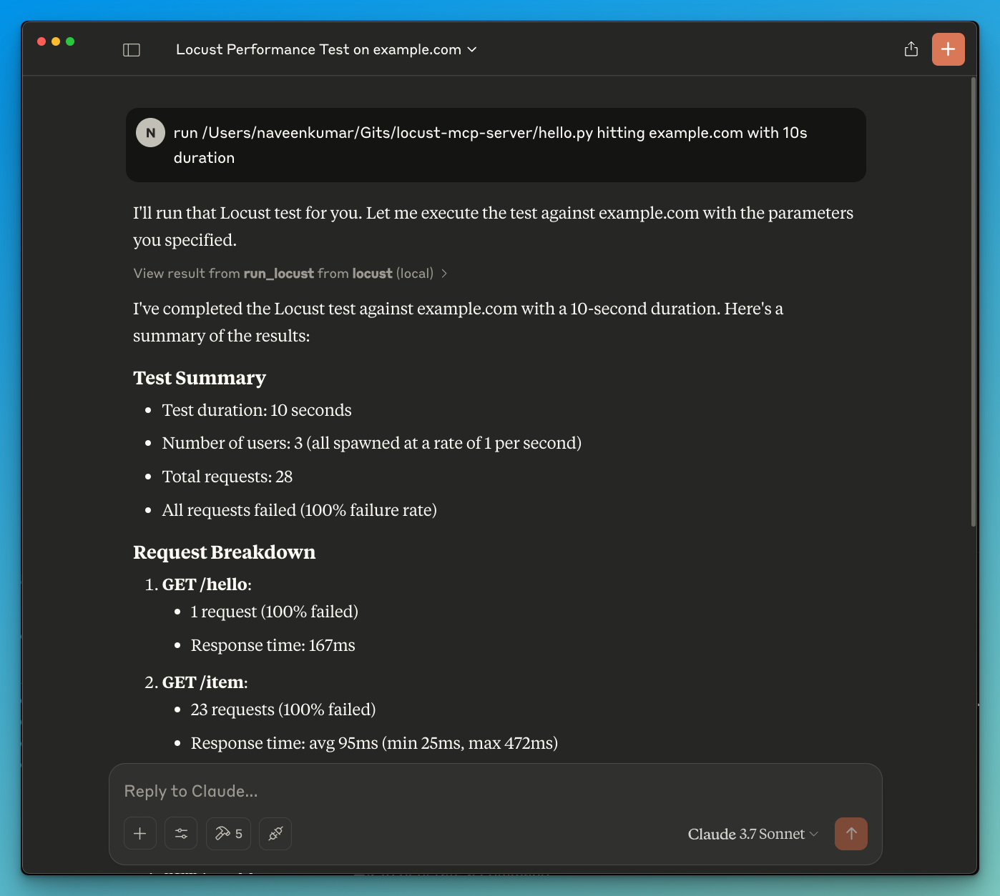

# 🚀 ⚡️ locust-mcp-server

A Model Context Protocol (MCP) server implementation for running Locust load tests. This server enables seamless integration of Locust load testing capabilities with AI-powered development environments.

## ✨ Features

- Simple integration with Model Context Protocol framework
- Support for headless and UI modes
- Configurable test parameters (users, spawn rate, runtime)
- Easy-to-use API for running Locust load tests
- Real-time test execution output
- HTTP/HTTPS protocol support out of the box
- Custom task scenarios support



## 🔧 Prerequisites

Before you begin, ensure you have the following installed:

- Python 3.13 or higher
- uv package manager ([Installation guide](https://github.com/astral-sh/uv))

## 📦 Installation

1. Clone the repository:

```bash
git clone https://github.com/yourusername/locust-mcp-server.git
```

2. Install the required dependencies:

```bash
uv pip install -r requirements.txt
```

3. Set up environment variables (optional):
   Create a `.env` file in the project root:

```bash
LOCUST_HOST=http://localhost:8089  # Default host for your tests
LOCUST_USERS=3                     # Default number of users
LOCUST_SPAWN_RATE=1               # Default user spawn rate
LOCUST_RUN_TIME=10s               # Default test duration
```

## 🚀 Getting Started

1. Create a Locust test script (e.g., `hello.py`):

```python
from locust import HttpUser, task, between

class QuickstartUser(HttpUser):
    wait_time = between(1, 5)

    @task
    def hello_world(self):
        self.client.get("/hello")
        self.client.get("/world")

    @task(3)
    def view_items(self):
        for item_id in range(10):
            self.client.get(f"/item?id={item_id}", name="/item")
            time.sleep(1)

    def on_start(self):
        self.client.post("/login", json={"username":"foo", "password":"bar"})
```

2. Configure the MCP server using the below specs in your favorite MCP client (Claude Desktop, Cursor, Windsurf and more):

```json
{
  "mcpServers": {
    "locust": {
      "command": "/Users/naveenkumar/.local/bin/uv",
      "args": [
        "--directory",
        "/Users/naveenkumar/Gits/locust-mcp-server",
        "run",
        "locust_server.py"
      ]
    }
  }
}
```

3. Now ask the LLM to run the test e.g. `run locust test for hello.py`. The Locust MCP server will use the following tool to start the test:

- `run_locust`: Run a test with configurable options for headless mode, host, runtime, users, and spawn rate

## 📝 API Reference

### Run Locust Test

```python
run_locust(
    test_file: str,
    headless: bool = True,
    host: str = "http://localhost:8089",
    runtime: str = "10s",
    users: int = 3,
    spawn_rate: int = 1
)
```

Parameters:

- `test_file`: Path to your Locust test script
- `headless`: Run in headless mode (True) or with UI (False)
- `host`: Target host to load test
- `runtime`: Test duration (e.g., "30s", "1m", "5m")
- `users`: Number of concurrent users to simulate
- `spawn_rate`: Rate at which users are spawned

## 🤝 Contributing

Contributions are welcome! Please feel free to submit a Pull Request.

## 📄 License

This project is licensed under the MIT License - see the LICENSE file for details.
